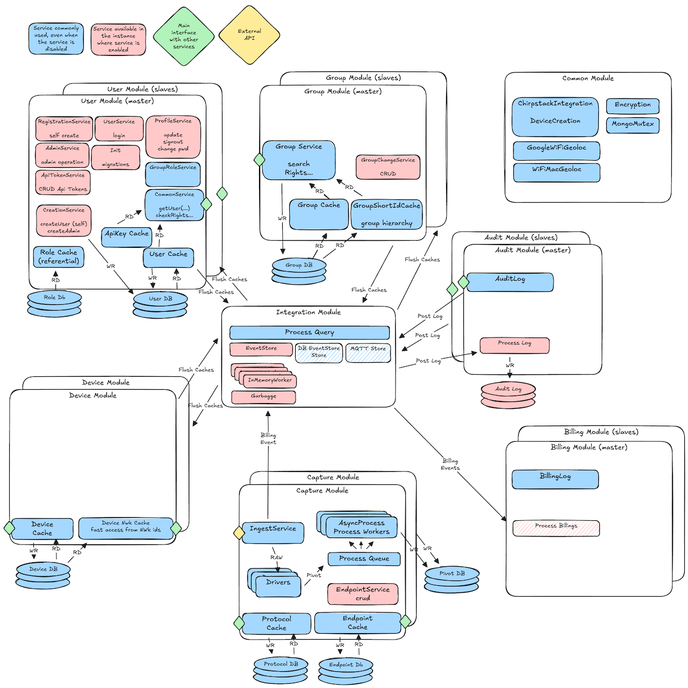

## Overall Architecture and philosophy

The objective of the IoT platform is to enable data integration and the management of a fleet 
of devices, which entails the need for monitoring and integration with communication providers 
and Network Servers. 

Its goal is to be business-agnostic, meaning that these APIs offer individual functionalities 
that can then be used to execute business processes. These workflows, which may resemble BPM 
(Business Process Management), are at a higher level and outside the platform.

The platform triggers events that initiate actions within a business process, which in turn must update 
statuses, for example. The ambition is for the platform to support business processes, including the ordering, 
manufacturing, enrollment, activation, replacement, and deactivation (...) of devices.

The data integration allows for raw data storage, enabling the replay of the transformation chain at a later 
stage.

Data transformation is a customizable process that does not require code recompilation and can be executed in a 
scalable manner. The data is broken down into individual elements, meaning that some entities have predefined definitions (battery, 
temperature, position...), while others can be dynamically defined by the user. These are generally referred to as 
metadata, enabling the solution to be adaptable.

The platform is designed to be modular, with each module being a package. Each module has its own but.

(preliminary)

### Software architecture

(in progress)

